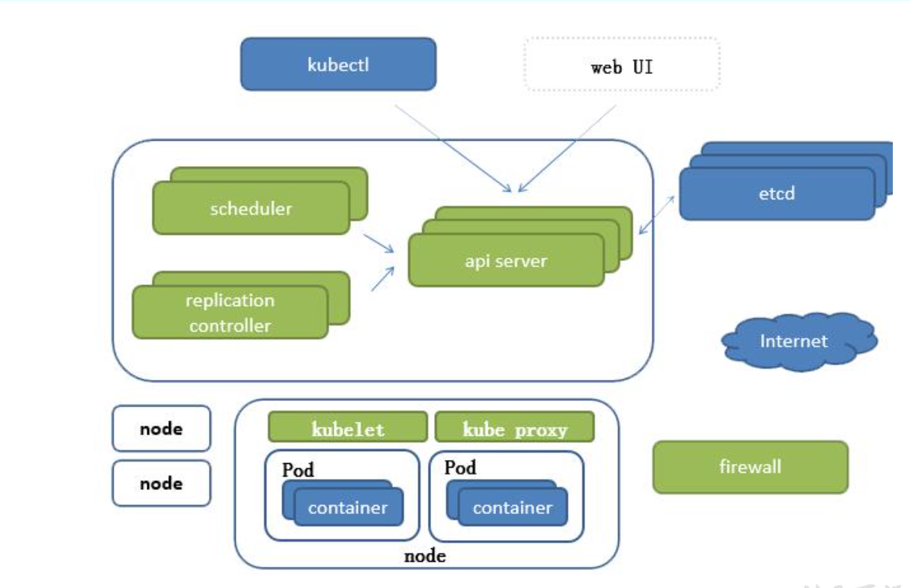

## 介绍说明

### 发展历史

资源管理器对比：

- MESOS 
    APACHE  分布式资源管理框架   2019-5  Twitter  > Kubernetes

- Docker Swarm  
    2019-07   阿里云宣布  Docker Swarm  剔除

- Kubernetes
    Google    10年容器化基础架构  borg   GO 语言   Borg
    - 特点：
		1. 轻量级：消耗资源小
		2. 开源
		3. 弹性伸缩
		4. 负载均衡：IPVS

### 组件说明

服务分类

- 有状态服务：DBMS  
- 无状态服务：LVS APACHE
	
高可用集群副本数据最好是 >= 3 奇数个

#### borg组件说明

#### k8s组件说明

- Scheduler：负责介绍任务，选择合适的节点进行分配任务
- replication controller：维持副本期望数目
- api server：所有服务访问统一入口

- ETCD：键值对数据库  储存K8S集群所有重要信息（持久化）

- Kubelet：直接跟容器引擎交互实现容器的生命周期管理
- Kube-proxy：负责写入规则至 IPTABLES、IPVS 实现服务映射访问的

重要插件：
- COREDNS：可以为集群中的SVC创建一个域名IP的对应关系解析
- DASHBOARD：给 K8S 集群提供一个 B/S 结构访问体系
- INGRESS CONTROLLER：官方只能实现四层代理，INGRESS 可以实现七层代理
- FEDERATION：提供一个可以跨集群中心多K8S统一管理功能
- PROMETHEUS：提供K8S集群的监控能力
- ELK：提供 K8S 集群日志统一分析介入平台

etcd 的官方将它定位成一个可信赖的分布式键值存储服务,它能够为整个分布式集群存。

## 基础概念

## Kubernetes

## 资源清单

## Pod 控制器

## 服务发现

## 存储

## 调度器

## 安全

## HELM

## 运维

MESOS  APACHE  分布式资源管理框架   2019-5  Twitter  》 Kubernetes

Docker Swarm  2019-07   阿里云宣布  Docker Swarm  剔除

Kubernetes  Google    10年容器化基础架构  borg   GO 语言   Borg 
	特点：
		轻量级：消耗资源小
		开源
		弹性伸缩
		负载均衡：IPVS
		
适合人群：软件工程师 测试工程师  运维工程师 软件架构师  项目经理

介绍说明：  前世今生   KUbernetes 框架  KUbernetes关键字含义

基础概念： 什么是 Pod   控制器类型  K8S 网络通讯模式 

Kubernetes：  构建 K8S 集群

资源清单：资源   掌握资源清单的语法   编写 Pod   掌握 Pod 的生命周期***

Pod 控制器：掌握各种控制器的特点以及使用定义方式

服务发现：掌握 SVC 原理及其构建方式

存储：掌握多种存储类型的特点 并且能够在不同环境中选择合适的存储方案（有自己的简介）

调度器：掌握调度器原理   能够根据要求把Pod 定义到想要的节点运行

安全：集群的认证  鉴权   访问控制 原理及其流程 

HELM：Linux yum    掌握 HELM 原理   HELM 模板自定义  HELM 部署一些常用插件

运维：修改Kubeadm 达到证书可用期限为 10年     能够构建高可用的 Kubernetes 集群

	
	

	
	
